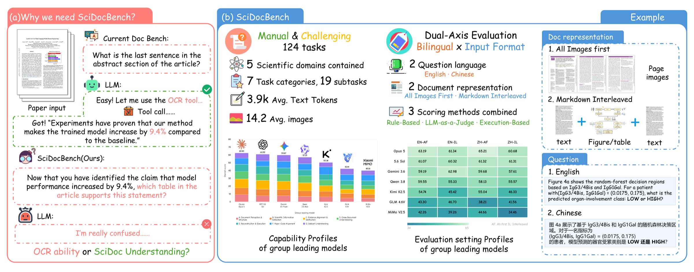

# SciDocBench: A Workflow-Centered Benchmark and Data Pipeline for Scientific Document Understanding

<p align="center">
  <a href="#paper"></a>
  <a href="https://github.com/open-compass/VLMEvalKit"></a>
  <a href="#release-plan"></a>
  <a href="#release-plan"></a>
</p>

<p align="center">
  <b>Shenxi Wu*</b>, <b>Yuhong Liu*</b>, Haosong Zhang, Tongjin Zou, Yanxun Zhang,<br>
  Gaochang Chen, Dun Liang, Jiaqi Wang, Zhecan James Wang, Yuhang Zang, Dahua Lin†
</p>

<p align="center"><i>* Equal contribution. † Corresponding author.</i></p>

<p align="center">
  
</p>

## News

- **2026-09-04:** The official repository is initialized.
- **2026-09-04:** SciDocBench is integrated into [VLMEvalKit](https://github.com/open-compass/VLMEvalKit). We recommend using VLMEvalKit for standardized inference and evaluation.

## Overview

Scientific papers combine text, equations, figures, tables, appendices, citations, code, and datasets. Reliable scientific-document assistants must therefore do more than retrieve visible text: they must locate evidence, verify numerical and logical relations, recover scientific structure, integrate information across documents, and produce reusable outputs.

**SciDocBench** evaluates these abilities through complete, evidence-grounded research tasks. It contains:

- **124** manually designed and difficulty-screened questions;
- **7** scientific-document capability groups and **19** subtasks;
- **5** scientific domains;
- **2** question languages: English and Chinese;
- **2** document representations: All Images First and Markdown Interleaved;
- **496** matched evaluation instances in total;
- **3** evaluator families: rule-based, LLM-as-a-judge, and execution-based evaluation.

Each question is instantiated under four matched settings while preserving its task semantics and evaluation criteria:

| Setting | Question language | Document representation |
|---|---|---|
| EN-AF | English | All Images First |
| EN-IL | English | Markdown Interleaved |
| ZH-AF | Chinese | All Images First |
| ZH-IL | Chinese | Markdown Interleaved |

## Capability Taxonomy

| Group | Capability |
|---|---|
| A | Document Perception and Structure |
| B | Scientific Information Extraction |
| C | Evidence Alignment and Verification |
| D | Cross-Document Understanding |
| E | Reconstruction and Execution |
| F | Paper-Code Alignment |
| G | Dataset Understanding |

## Leaderboard

Overall scores are computed over all 496 evaluation instances on a 0-100 scale. Failed or unusable responses receive zero.

| Rank | Model | Overall | EN-AF | EN-IL | ZH-AF | ZH-IL |
|---:|---|---:|---:|---:|---:|---:|
| 1 | **Claude Opus 5** | **62.60** | 63.19 | 61.34 | 65.21 | 60.68 |
| 2 | **GPT-5.6-Sol** | **61.00** | 61.07 | 60.32 | 61.32 | 61.31 |
| 3 | **Gemini 3.6 Flash** | **59.87** | 59.19 | 62.98 | 59.68 | 57.61 |
| 4 | Qwen3.8-Max | 57.15 | 59.55 | 55.33 | 58.13 | 55.57 |
| 5 | Qwen3.7-Plus | 55.88 | 57.17 | 53.34 | 57.57 | 55.42 |
| 6 | GPT-5.6-Terra | 54.19 | 51.88 | 55.69 | 52.83 | 56.37 |
| 7 | Claude Opus 4.8 | 53.41 | 53.63 | 52.43 | 54.13 | 53.46 |
| 8 | Qwen3.8-27B | 52.89 | 58.65 | 47.25 | 54.21 | 51.46 |
| 9 | GPT-5.6-Luna | 50.58 | 47.55 | 53.99 | 46.65 | 54.13 |
| 10 | Kimi K2.5 | 50.38 | 54.74 | 45.42 | 55.04 | 46.33 |
| 11 | Claude Sonnet 4.6 | 49.57 | 52.25 | 51.18 | 53.62 | 41.21 |
| 12 | GLM-4.6V | 42.44 | 43.30 | 46.70 | 38.21 | 41.56 |
| 13 | Claude Haiku 4.5 | 40.35 | 38.18 | 42.72 | 38.33 | 42.16 |
| 14 | MiMo-V2.5 | 40.16 | 42.26 | 39.26 | 44.66 | 34.46 |

Claude Opus 5 currently ranks first with 62.60, followed by GPT-5.6-Sol with 61.00 and Gemini 3.6 Flash with 59.87. No evaluated model reaches 63. Capability leaders are distributed across model families, indicating that strong performance in one scientific-document skill does not automatically transfer to the complete workflow. For 11 of the 14 evaluated models, the document-representation gap is larger than the question-language gap.

## Evaluation with VLMEvalKit

SciDocBench is available in [VLMEvalKit](https://github.com/open-compass/VLMEvalKit), which is the recommended evaluation entry point. From a VLMEvalKit checkout, run:

```bash
python run.py --data SciDocBench --model <MODEL_NAME> --verbose
```

Replace `<MODEL_NAME>` with a model registered in VLMEvalKit. The command performs inference and evaluation and downloads the benchmark metadata through VLMEvalKit. Configure the credentials required by the selected model and semantic judge according to the VLMEvalKit documentation.

## Paper

**SciDocBench: A Workflow-Centered Benchmark and Data Pipeline for Scientific Document Understanding**  
Shenxi Wu, Yuhong Liu, Haosong Zhang, Tongjin Zou, Yanxun Zhang, Gaochang Chen, Dun Liang, Jiaqi Wang, Zhecan James Wang, Yuhang Zang, and Dahua Lin.

The arXiv link will be added after submission.

## Release Plan

| Component | Status |
|---|---|
| Paper and benchmark description | Manuscript ready; arXiv link pending |
| Standardized evaluation | Available through VLMEvalKit |
| SciDocBench data and document assets | **TODO** |
| SciDocDataset SFT and RL data | **TODO** |
| SciDocIR preprocessing and data-generation code | **TODO** |
| Detailed reproduction documentation | **TODO** |

The benchmark data, training data, and data-generation code are being audited for provenance, licensing, and reproducibility before public release.

## Citation

Please use the following temporary citation. The entry will be updated with the arXiv identifier.

```bibtex
@article{wu2026scidocbench,
  title   = {SciDocBench: A Workflow-Centered Benchmark and Data Pipeline for Scientific Document Understanding},
  author  = {Wu, Shenxi and Liu, Yuhong and Zhang, Haosong and Zou, Tongjin and Zhang, Yanxun and Chen, Gaochang and Liang, Dun and Wang, Jiaqi and Wang, Zhecan James and Zang, Yuhang and Lin, Dahua},
  journal = {arXiv preprint},
  year    = {2026}
}
```

## Acknowledgements

We thank the [VLMEvalKit](https://github.com/open-compass/VLMEvalKit) team for providing the standardized evaluation framework.

## License

The licenses for the benchmark, document assets, and generated data will be specified with their public release.
